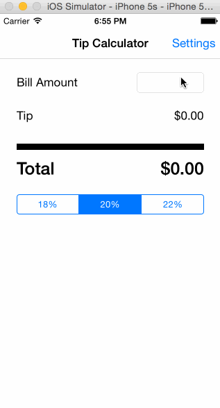

# TipCalculator
This is a Tip Calculator application for iOS submitted as the pre-assignment requirement for Codepath.

Time spent: 6 hours

Completed:

Required {completed}: User can enter a bill amount, choose a tip percentage, and see the tip and total values.

Required {completed}: Settings page to change the default tip percentage.

Note: Not sure why my code files are appearing as Readme files

